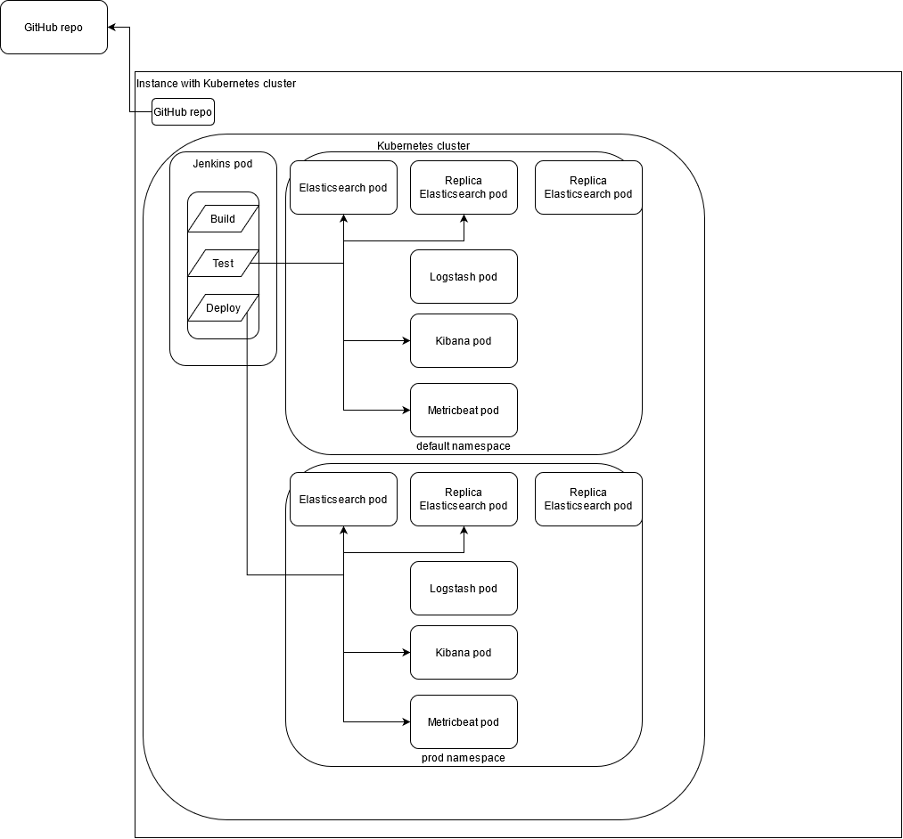

# little-elk #
Little ELK setup deployed through Jenkins on a Kubernetes cluster.
The Jenkins server itself starts in that cluster.
Other technologies involved are microk8s and helm3.

## Setup ##
Sets up the Kubernetes cluster on a local machine.
This was tested on Ubuntu.
- `sudo snap install microk8s --classic`
- `sudo usermod -a -G microk8s $USER`
- `sudo chown -f -R $USER ~/.kube`
- `sudo microk8s config > ~/.kube/config`
- `microk8s enable dns helm3 metallb hostpath-storage`
- `microk8s enable ingress host-path hostpath-storage metrics-server microk8s-hostpath`

Adds the Jenkins pod to helm.
- `microk8s.helm3 repo add jenkins https://charts.jenkins.io`
- `microk8s.helm3 repo update`

## Usage ##
Sets up a Jenkins pod. In the **values.yaml** file, the pipeline is seeded to
the corresponding GitHub [repo](https://github.com/PaulOberm/little-elk)

- `microk8s.helm3 upgrade --install esjenkins jenkins/jenkins -f values.yaml`

Get password to Jenkins admin user through
- `sudo su -`
- `microk8s kubectl exec --namespace default -it svc/jenkins -c jenkins -- /bin/cat /run/secrets/additional/chart-admin-password && echo`

## Shutdown ##
- `microk8s.helm3 uninstall esjenkins`

## Debug ##
- `microk8s.kubectl logs jenkins-0 --tail 100 -f`
- `ls -lrt /home/ubuntu/little-elk/values.yaml`
- `microk8s.kubectl get pods --all-namespaces`
- `microk8s.kubectl describe pod jenkins-0`
- `microk8s.kubectl  -n ingress describe  daemonset.apps/nginx-ingress-microk8s-controller`